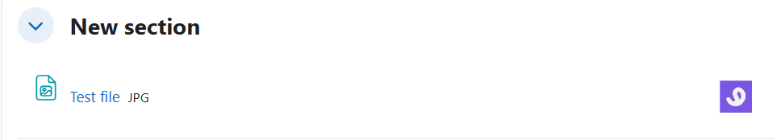
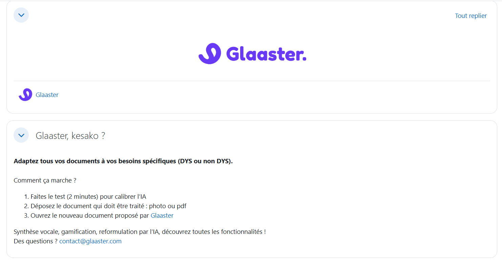
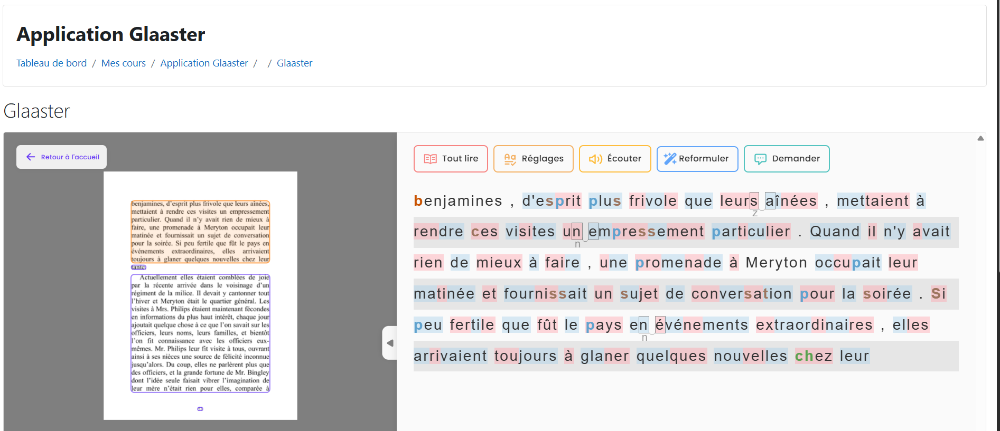
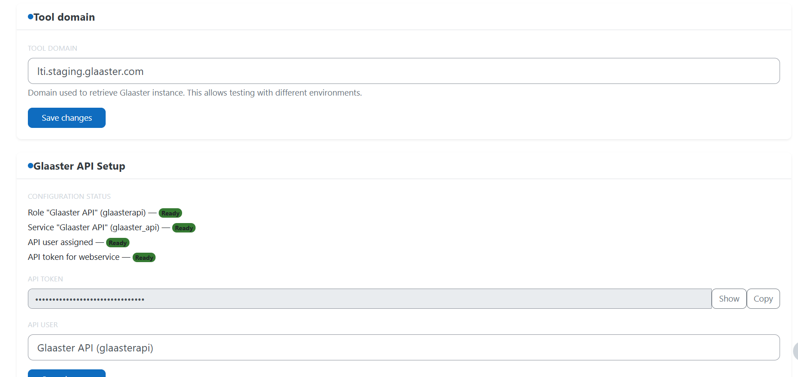

# Glaaster Activity Plugin for Moodle

[](https://moodle.org)
[](https://php.net)
[](https://www.imsglobal.org/spec/lti/v1p3/)
[](https://www.gnu.org/licenses/gpl-3.0)
[](https://github.com/glaaster/moodle-mod_glaaster/releases)

The **Glaaster Activity** plugin is a Moodle activity module that integrates [Glaaster](https://glaaster.com) — a collaborative document reader — directly into Moodle courses via LTI 1.3/Advantage. Students can open course files (PDF, Word, PowerPoint, images) in Glaaster with a single click, without leaving Moodle.


> **Note**: This plugin is a companion to the [Glaaster](https://glaaster.com) document platform.
> It requires an active Glaaster account and access to the Glaaster LTI service.


---

## Screenshots

### Contextual "Open with Glaaster" Button on Course Files






### Glaaster Reader Loaded in Moodle (LTI iframe)




### Tool Management (Admin)



---

## Features

- **LTI 1.3 / Advantage** — Full OpenID Connect authentication, JWT launch flow, Assignment & Grade Services (AGS), Names and Role Provisioning Service (NRPS)
- **Contextual buttons** — Automatically detects supported files in your course (PDF, DOCX, PPTX, ODT, ODP, JPG, PNG) and adds an "Open with Glaaster" button next to each
- **Folder support** — Works with Moodle Folder resources and subfolders; filenames with special characters are safely Base64-encoded
- **Real-time instance validation** — MutationObserver detects when the Glaaster activity is removed from the course page in under 500ms and hides buttons accordingly
- **Custom JWT claims** — Forwards `resource_id`, `file_name`, and `file_path` as custom claims so Glaaster loads the exact file the student clicked
- **Zero-auth web service** — `mod_glaaster_validate_instance` is intentionally unauthenticated for performance (no sensitive data exposed)
- **Moodle 4.3 → 4.5+** support across multiple maintained branches

---

## Requirements

| Requirement | Version |
|-------------|---------|
| Moodle | 4.5 or later |
| PHP | 8.1 or later |
| Database | PostgreSQL or MariaDB/MySQL |
| PHP Extensions | `curl`, `openssl`, `json`, `mbstring` |
| Glaaster account  | (see [glaaster.com](https://glaaster.com)) |


---

## Installation

### Option A — Moodle Plugin Directory (recommended)

1. Go to **Site administration → Plugins → Install plugins**
2. Search for **Glaaster** or upload the ZIP directly
3. Click **Install plugin from the ZIP file**
4. Follow the on-screen upgrade steps

### Option B — Manual (ZIP)

1. Download the latest ZIP from [Releases](https://github.com/Glaaster/moodle-glaaster_activity/releases)
2. Extract to your Moodle directory so that `version.php` is at:
   ```
   moodle/mod/glaaster/version.php
   ```
3. In Moodle, go to **Site administration → Notifications** (or run `php admin/cli/upgrade.php`)

### Option C — Git (development)

```bash
cd /path/to/moodle
git clone https://github.com/Glaaster/moodle-glaaster_activity.git mod/glaaster
php admin/cli/upgrade.php
```

---

## Configuration

### 1. Register the Glaaster LTI Tool

After installation, go to **Site administration → Plugins → Activity modules → Glaaster**:

1. **Tool domain**: Set to your Glaaster LTI hostname (default: `lti.glaaster.com`).
2. **API user**: Select a Moodle user that the Glaaster service will use to call Moodle web services.
3. **API token**: Generate a token for the selected API user.

The plugin automatically creates and enables the `Glaaster API` web service with the required
functions (`mod_resource_get_resources_by_courses`, `core_files_get_files`,
`core_course_get_contents`).


### 2. Add the Activity to a Course

1. Enter a course and turn editing on
2. **Add an activity or resource → Glaaster**
3. Select the pre-configured **Glaaster** tool
4. Save — the contextual buttons will appear automatically next to compatible files in the course

---

## Uninstallation

1. **Site administration → Plugins → Activity modules → Glaaster → Uninstall**
2. Confirm removal — this drops the plugin's database tables and removes all Glaaster activities from courses

---

## Versioning

This plugin follows [Semantic Versioning](https://semver.org). Each Moodle-version branch (`main`, `moodle/4.4`, …) has its own independent version line (`1.x.x`). Releases are automated via CI using [Conventional Commits](https://www.conventionalcommits.org).

See [CHANGES](CHANGES.md) for the full history.

---

## Usage

Once configured, add a **Glaaster** activity to any course section. The plugin will display
contextual "Open in Glaaster" buttons next to supported file resources in the course page.
Clicking a button launches the file directly inside the Glaaster document viewer via LTI 1.3.

## Support

- Documentation: [docs.glaaster.com](https://docs.glaaster.com)
- Issues: contact system@glaaster.com


## Development

### Prerequisites

- Node.js 22.11+ (< 23)
- Yarn 4.9.1
- PHP 7.4+

### Build

```bash
yarn install        # Install JS dependencies
grunt               # Build AMD modules + compile SCSS
grunt watch         # Watch for changes
grunt eslint        # Lint JavaScript
grunt stylelint     # Lint SCSS
```

### Testing

```bash
moodle-plugin-ci phplint
moodle-plugin-ci phpunit --fail-on-warning
moodle-plugin-ci behat --profile chrome --scss-deprecations
moodle-plugin-ci phpcs --max-warnings 0
```

### HTTPS for Local LTI Testing

LTI 1.3 requires HTTPS. Use Cloudflare Tunnel during development:

```bash
cloudflared tunnel --url http://localhost:8080
```

---

## Troubleshooting

| Symptom | Solution |
|---------|----------|
| Buttons not appearing | Verify a Glaaster activity exists in the course and is visible (`visible = 1`). Purge caches. |
| Invalid JWT signature | Check `wwwroot` is correct. Verify JWKS endpoint is reachable. Sync server clock. |
| Web service not found | Run `php admin/cli/upgrade.php` to re-register services. |
| Files missing from folder | Ensure folder resource is visible. Check browser console for AJAX errors. |

Full troubleshooting guide: [docs/quickstart.md](docs/quickstart.md)

---

## Acknowledgements

This plugin is forked from the Moodle core `mod/lti` module (MOODLE_405_STABLE), originally created by Marc Alier, Jordi Piguillem, and Nikolas Galanis at the Universitat Politècnica de Catalunya, with contributions from Charles Severance and the Moodle community.

---

## License

This plugin is free software: you can redistribute it and/or modify it under the terms of the [GNU General Public License v3](https://www.gnu.org/licenses/gpl-3.0) as published by the Free Software Foundation.
